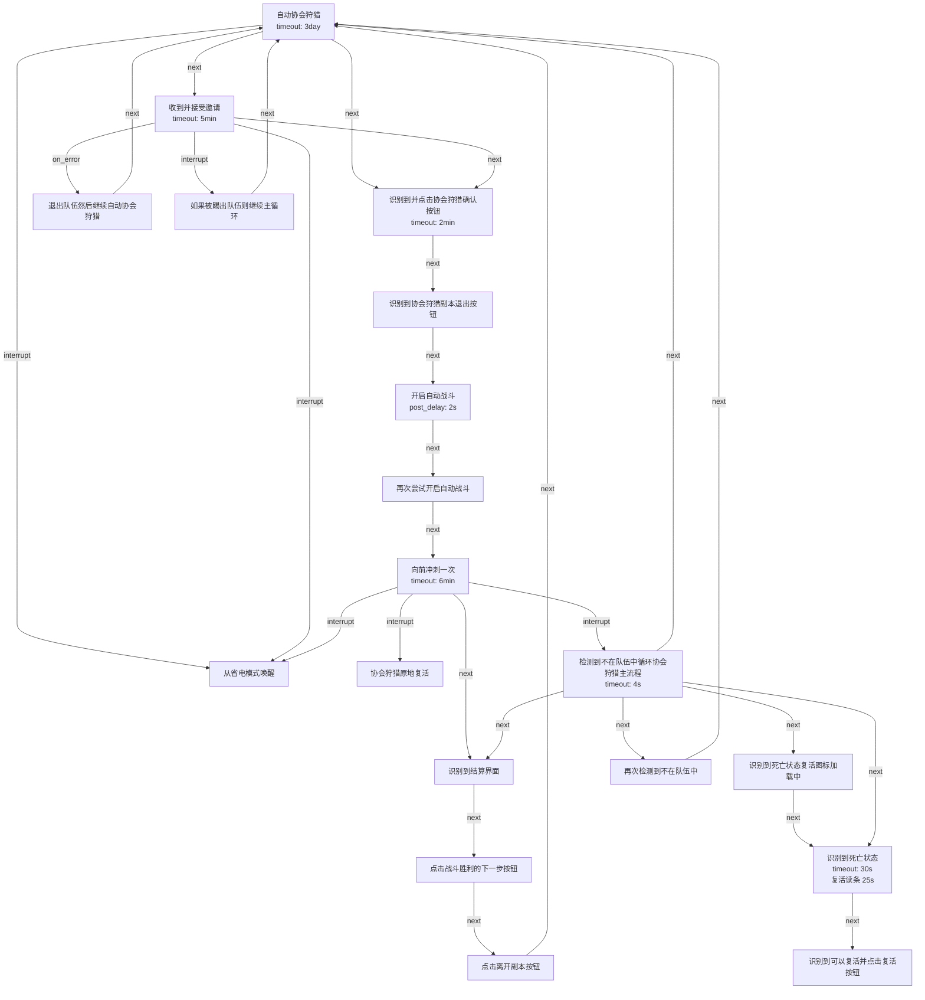

# 说明和目录

- [对使用者而言](#对使用者而言)
- [对协会其他成员而言](#对协会其他成员而言)
- [自动狩猎简要流程](#自动狩猎简要流程)

---

## 对使用者而言

使用模拟器启动星痕共鸣, 这里以 MuMu 模拟器为例:

可以将角色放置在协会前台, 这样其他成员知道这个号是可以拉来打协会狩猎的

---

解压压缩包后, 运行其中的 `MFAAvalonia.exe`

> 也可以为这个 exe 创建快捷方式再重命名, 例如:
>
> 

启动后, MAAStarResonance 会尝试根据下图红框所框选的部分链接模拟器

- 如果目前只开了一个模拟器的话此时应该是可以正常连上的

- 如果目前开了多个模拟器的话则需要在如下模拟器下拉列表中选择目标模拟器:

  

  > 有时可能会出现列表中只有一个模拟器但是实际开了多个模拟器的情况, 如下:
  >
  > 
  >
  > 此时只需要先将光标切换到 `桌面应用`:
  >
  > 
  >
  > 加载出出面应用的信息然后再切回模拟器加载模拟器的信息即可:
  >
  > 

由于列表中我们需要根据模拟器的 adb 端口号来选择对应的模拟器, 所以我们需要确认我们当前目标账号所在的模拟器的 adb 端口号是多少

以 Mumu 为例, 可以在 `设备诊断` 中查看当前模拟器端口号, 如下图:

---

连接上模拟器后会进入启动python agent 以及安装/更新依赖的过程, 这个过程根据电脑性能情况耗时有所区别, 不需要额外操作, 只需等待即可:

> PS: 这个操作不会影响当前电脑的全局环境, 所有依赖安装修改均在当前 MAAStarResonance 目录下进行

可以在左侧工具栏的切换到 `截图` 页面, 进行模拟器截图以确认是否为目标模拟器/账号

---

然后切换到主页, 勾选 `自动协会狩猎` 并点击 `开始任务` 即可:

协会狩猎是个循环任务, 当前设置的循环周期为 3 日, 可以点击左下角的 `停止任务` 按钮手动停止:

---

## 对协会其他成员而言

- 可以约定好哪些成员账号是可以自动协会狩猎的, 例如在协会前台的号都是挂了自动协会狩猎的

- 此时只需要到协会前台看一眼哪些账号可以拉即可按照当前协会狩猎队伍需要邀请对应的账号, 邀请后会自动入队

- 正常进入协会狩猎副本

  - 由于模拟器性能不如 PC 和 手机, 因此挂自动的账号加载的会比较慢, 建议等队伍中的 T 先开怪

  - 尽量保持战斗在进入狩猎的起始位置所在半场附近, 拉太远的话模拟器可能加载不到怪物和队友模型而发呆

  - 自动狩猎的账号进入副本后会开启自动战斗并向前冲刺一次, 倒地会自动复活

  - 遇到蜘蛛建议不打, 自动战斗打蜘蛛还是太费劲了

    - 选择不打的话请**务必**在狩猎局内将自动狩猎的号踢出队伍

      如果在局外踢的话, 最后一个被踢的号会被留在局内

    - 有信心也可以打, 就是自动狩猎的账号每次蜘蛛钻出来都容易死

  - 正常狩猎胜利继续下一次狩猎即可

  - 狩猎完成后 **务必** 将自动狩猎的号移除队伍

---

## 自动狩猎简要流程

